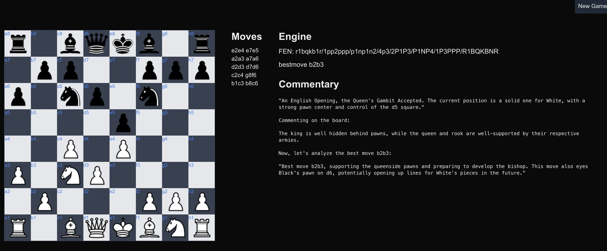

# Chess Edu

- chessapp: nextjs ui, containing the chess board and calling other services
- stockfish: engine
- stockfishapi: express app talking to stockfish engine
- llm: install Olama, it will then be available via localhost:port

## Disclamer

This is a quick project, nothing special, so everything was done in the simplest and most straightforward way possible.